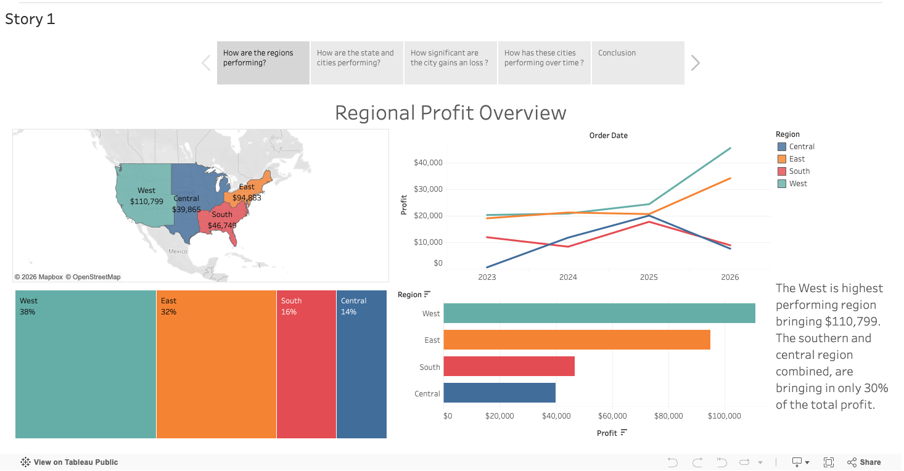
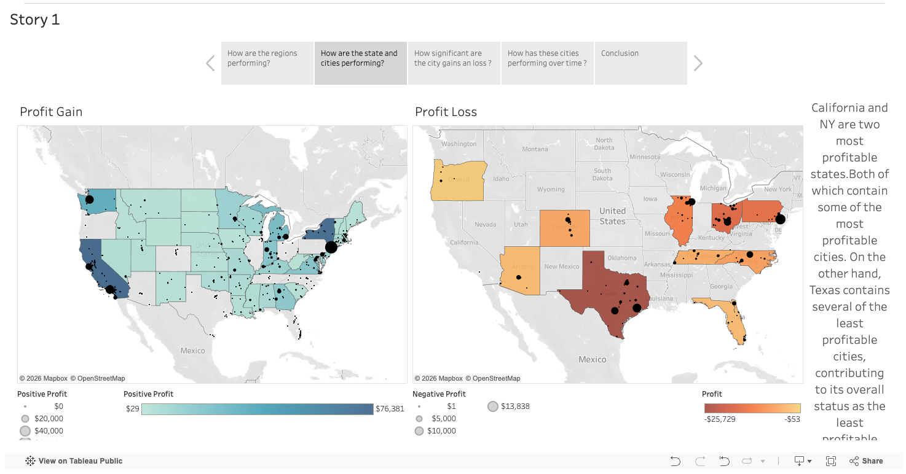
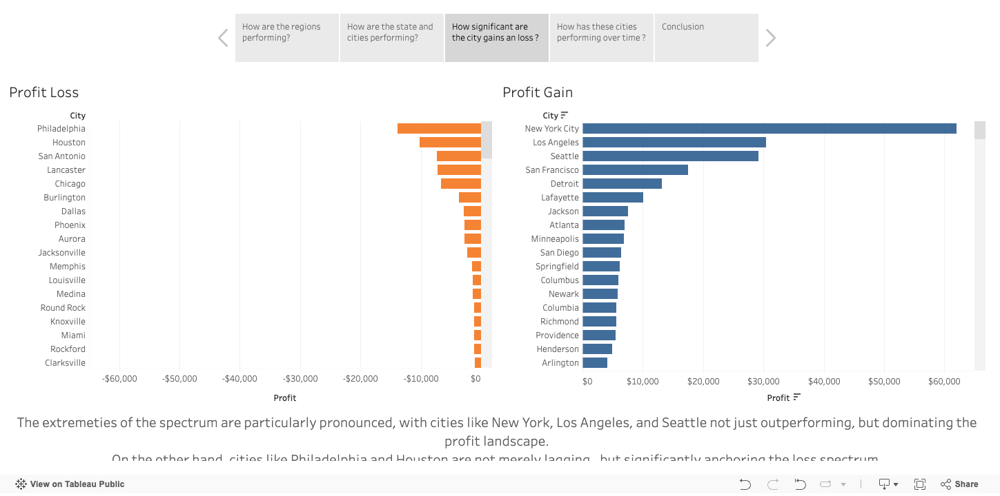
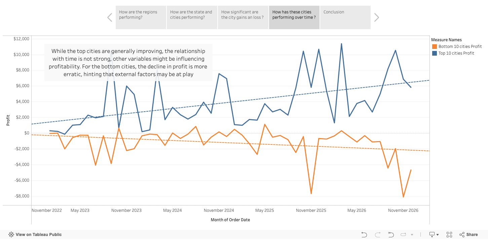

# US Regional Profit Analysis – Tableau Story

An interactive data story exploring profit performance across US regions, 
states, and cities using sales order data (2022–2026).

## 🔗 Live Demo
[View Interactive Story on Tableau Public](https://public.tableau.com/views/ProfitOverview_17793069907820/Story1?:language=en-US&:sid=&:redirect=auth&:display_count=n&:origin=viz_share_link)
## 📖 Story Pages

| Page | Question | Key Insight |
|------|----------|-------------|
| 1 | How are the regions performing? | West leads with $110,799 (38%); South & Central combined only 30% |
| 2 | How are the state and cities performing? | California and NY are the most profitable states; Texas has the most loss cities |
| 3 | How significant are the city gains and losses? | NYC, LA, and Seattle dominate gains; Philadelphia and Houston anchor losses |
| 4 | How have cities performed over time? | Top cities trend upward; bottom cities show erratic, worsening decline |

## 📸 Preview

### Page 1 – Regional Profit Overview

### Page 2 – State & City Performance

### Page 3 – City Profit Gains vs Losses

### Page 4 – City Performance Over Time

## 📊 Data Source
- **Dataset:** Superstore Sales
- **Time Period:** 2022–2026
- **Scope:** US regions, states, and cities

## 🛠 Tools Used
- Tableau Desktop / Tableau Public

